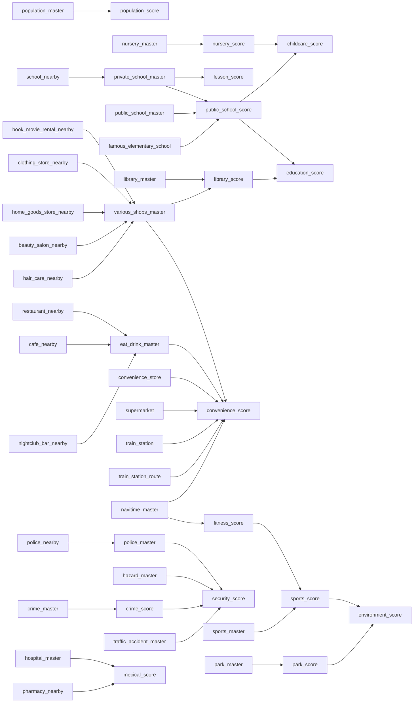
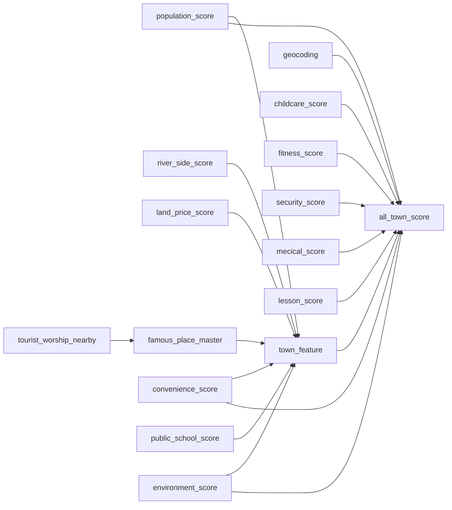

# tokyo-storyで使うデータの分析と前処理

## 一次前処理

```mermaid
flowchart LR
    population_master --> population_score
    
    nursery_master --> nursery_score --> childcare_score
    public_school_score --> childcare_score

    private_school_master --> lesson_score
    school_nearby --> private_school_master --> public_school_score
    public_school_master --> public_school_score
    
    famous_elementary_school --> public_school_score
    public_school_score --> education_score
    library_master --> library_score --> education_score
    various_shops_master --> library_score

    book_movie_rental_nearby --> various_shops_master
    clothing_store_nearby --> various_shops_master
    home_goods_store_nearby --> various_shops_master
    beauty_salon_nearby --> various_shops_master
    hair_care_nearby --> various_shops_master

    restaurant_nearby --> eat_drink_master
    cafe_nearby --> eat_drink_master
    nightclub_bar_nearby --> eat_drink_master

    convenience_store --> convenience_score
    supermarket --> convenience_score
    train_station --> convenience_score
    train_station_route --> convenience_score
    eat_drink_master --> convenience_score
    navitime_master --> convenience_score
    various_shops_master --> convenience_score
    
    navitime_master --> fitness_score

    police_nearby --> police_master --> security_score
    hazard_master --> security_score
    crime_master --> crime_score --> security_score
    traffic_accident_master --> security_score
    

    fitness_score --> sports_score
    sports_master --> sports_score --> environment_score
    park_master --> park_score --> environment_score
    

    hospital_master --> mecical_score
    pharmacy_nearby --> mecical_score
    
```

## 二次前処理

```mermaid
flowchart LR
    population_score --> town_feature
    river_side_score --> town_feature
    land_price_score --> town_feature
    tourist_worship_nearby --> famous_place_master --> town_feature
    convenience_score --> town_feature
    public_school_score --> town_feature
    environment_score --> town_feature
    town_feature --> all_town_score

    population_score --> all_town_score
    geocoding --> all_town_score
    childcare_score --> all_town_score
    convenience_score --> all_town_score
    fitness_score --> all_town_score
    security_score --> all_town_score
    environment_score --> all_town_score
    mecical_score --> all_town_score
    lesson_score --> all_town_score
```